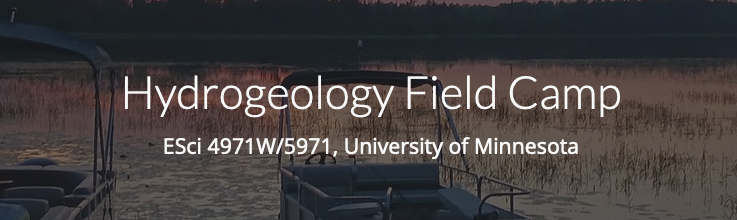

# MODFLOW Workshop
MODFLOW workshop materials for [Hydrogeology Field Camp](https://sites.google.com/a/umn.edu/hydrogeology-field-camp/), ESci 4971W/5971, University of Minnesota

## Date and Location
* August 11, 2025, 1:00 PM -- 4:00 PM
* Hybrid (Tate Hall, Minneapolis & Online synchronous)	

## Workshop Description
The purpose of this half-day introductory workshop is to help hydrogeologists get up and running with MODFLOW and the Python FloPy package for creating, running, and post-processing models.  Participants will need to bring a laptop computer to the workshop; the [Software Installation Page](./SOFTWARE.md) has instructions for installing the required software.

## Intended Audience
This workshop is a brief introduction to MODFLOW for undergraduate and graduate students.  No previous experience with Python is required, however, participants without any Python experience may benefit from additional preparation prior to the class.

## Workshop Instructor
* [Christian Langevin, S.S. Papdopulos & Associates](https://sspa.com/christian-langevin-phd/)

## Topics
* MODFLOW Overview
* MODFLOW and FloPy demonstration
* Example 1: Toth
* Example 2: Freshwater Island
* Example 3: Confined Aquifer Pumping Test
* Example 4: Leaky Aquifer Pumping Test

## Software
See the [Software Installation Page](./SOFTWARE.md) for software installation instructions.
